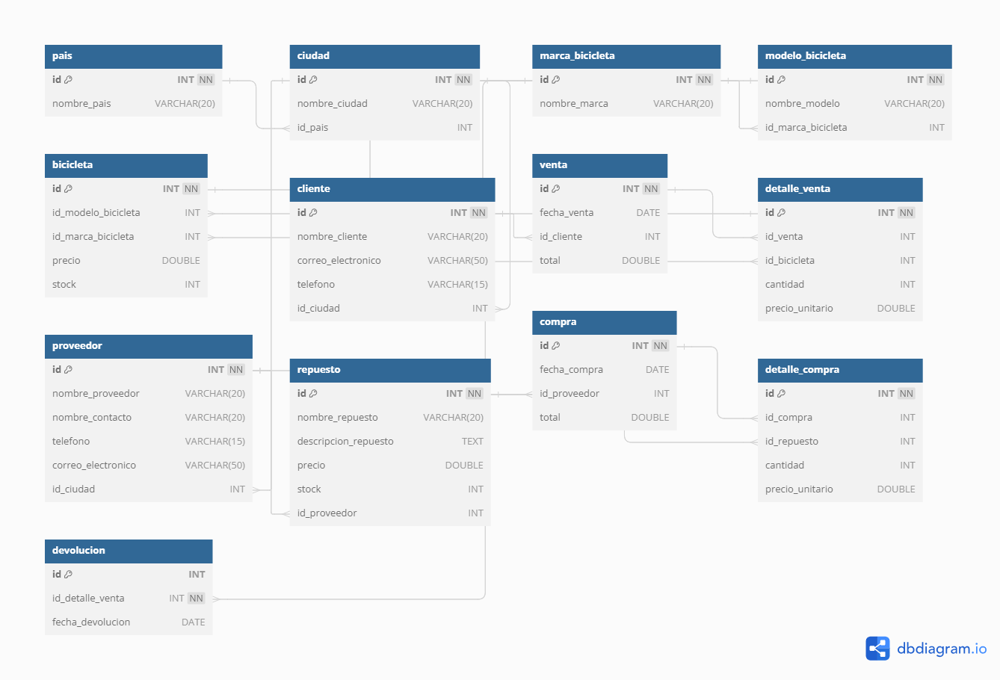

# Casos de Uso para la Base de Datos

  ### Karol Ramirez - Laura Torres

### Caso de Uso 1: Gestión de Inventario de Bicicletas

**Descripción: Este caso de uso describe cómo el sistema gestiona el inventario de bicicletas,**
**permitiendo agregar nuevas bicicletas, actualizar la información existente y eliminar bicicletas que**
**ya no están disponibles.**

##### Actores:

Administrador de Inventario

##### Flujo Principal:

1. El administrador de inventario ingresa al sistema. 
2. El administrador selecciona la opción para agregar una nueva bicicleta.x
3. El administrador ingresa los detalles de la bicicleta (modelo, marca, precio, stock).
4. El sistema valida y guarda la información de la nueva bicicleta.

   ```sql

      PROCEDIMIENTO PARA AGREGAR UNA NUEVA BICI

      DELIMITER $$
      CREATE PROCEDURE addBicicleta(
         IN modeloid INT,
         IN marcaid INT,
         IN precios DOUBLE,
         IN stockbici INT
      )
      BEGIN
         INSERT INTO bicicleta (id_modelo_bicicleta, id_marca_bicicleta, precio, stock) 
         VALUES (modeloid, marcaid, precios, stockbici);
      END $$
      DELIMITER ;

      VALIDAR ENTRADAS DE BICI

      DELIMITER $$
      CREATE TRIGGER validar_campos_obligatorios
      BEFORE INSERT ON bicicleta
      FOR EACH ROW
      BEGIN
         IF NEW.id_modelo_bicicleta IS NULL THEN
            SIGNAL SQLSTATE '45000'
            SET MESSAGE_TEXT = 'El campo modelo es OBLIGATORIO y no puede ser NULL';
         END IF;
         IF NEW.id_marca_bicicleta IS NULL THEN 
            SIGNAL SQLSTATE '45000'
            SET MESSAGE_TEXT = 'El campo marca es OBLIGATORIO y no puede ser NULL';
         END IF;
         IF NEW.precio IS NULL THEN
            SIGNAL SQLSTATE '45000'
            SET MESSAGE_TEXT = 'El campo precio es OBLIGATORIO y no puede ser NULL';
         END IF;
         IF NEW.stock IS NULL THEN
            SIGNAL SQLSTATE '45000'
            SET MESSAGE_TEXT = 'El campo stock es OBLIGATORIO y no puede ser NULL';
         END IF;
      END $$
      DELIMITER ;

      VALIDAR QUE NO SEAN DATOS NEGATIVOS 

      
      DELIMITER $$
      DROP TRIGGER IF EXISTS stockNegativoIns $$
      CREATE TRIGGER stockNegativoIns
      BEFORE INSERT ON bicicleta
      FOR EACH ROW
      BEGIN
         IF NEW.stock < 0 OR NEW.precio < 0 THEN
            SIGNAL SQLSTATE '45000' SET MESSAGE_TEXT = 'El "STOCK" y el "PRECIO" no pueden ser negativo';
         END IF;
      END $$
      DELIMITER ;

   ```

5. El administrador selecciona una bicicleta existente para actualizar.
6. El administrador actualiza la información (precio, stock).
7. El sistema valida y guarda los cambios.

   ```sql
   DELIMITER $$
      CREATE PROCEDURE updateStockBici(
         IN BicicletaId INT,
         IN Precio DOUBLE,
         IN Stock INT
      )
      BEGIN
         UPDATE bicicleta
         SET precio = Precio, stock = Stock
         WHERE id = BicicletaId;
      END$$
      DELIMITER ;

      TRIGGER PARA EL UPDATE

      DELIMITER $$ 
      DROP TRIGGER IF EXISTS validar_campos_obligatorios_upd$$
      CREATE TRIGGER validar_campos_obligatorios_upd
      BEFORE UPDATE ON bicicleta
      FOR EACH ROW
      BEGIN
         IF NEW.precio IS NULL THEN
            SIGNAL SQLSTATE '45000'
            SET MESSAGE_TEXT = 'El campo precio es OBLIGATORIO y no puede ser NULL';
         END IF;
         IF NEW.stock IS NULL THEN
            SIGNAL SQLSTATE '45000'
            SET MESSAGE_TEXT = 'El campo stock es OBLIGATORIO y no puede ser NULL';
         END IF;
      END$$

      DELIMITER ;
   ```

8. El administrador selecciona una bicicleta para eliminar.
9. El sistema elimina la bicicleta seleccionada del inventario.

   ```sql
   DELIMITER $$
   CREATE PROCEDURE deleteBici(
      IN idBici INT
   )
   BEGIN
      DELETE FROM bicicleta
      WHERE id = idBici;
   END$$
   DELIMITER ;
   ```

### Caso de Uso 2: Registro de Ventas

**Descripción: Este caso de uso describe el proceso de registro de una venta de bicicletas,**

**incluyendo la creación de una nueva venta, la selección de las bicicletas vendidas y el cálculo del**
**total de la venta.**

##### Actores:

Vendedor

##### Flujo Principal:

1. El vendedor ingresa al sistema.
2. El vendedor selecciona la opción para registrar una nueva venta.
3. El vendedor selecciona el cliente que realiza la compra.
4. El vendedor selecciona las bicicletas que el cliente desea comprar y especifica la cantidad.
5. El sistema calcula el total de la venta.

```sql

     DELIMITER $$
      DROP PROCEDURE IF EXISTS registrarVentaConDetalles$$
      CREATE PROCEDURE registrarVentaConDetalles(
         IN clienteid VARCHAR(10),
         IN biciId INT,
         IN Cantidad INT,
         OUT outVentaId INT 
      )
      BEGIN
         DECLARE precioUnitario DOUBLE;
         DECLARE totalDetalle DOUBLE;
         
         INSERT INTO venta(fecha_venta, id_cliente,total)
         VALUES (NOW(), clienteid,0);

         SET outVentaId = LAST_INSERT_ID();
         
         SELECT precio INTO precioUnitario
         FROM bicicleta
         WHERE id = biciId;

         SET totalDetalle = precioUnitario * Cantidad;

         INSERT INTO detalle_venta (id_venta, id_bicicleta, cantidad, precio_unitario)
         VALUES (outVentaId, biciId, Cantidad, precioUnitario);

         UPDATE venta
         SET total = totalDetalle
         WHERE id = outVentaId;

         UPDATE bicicleta
         SET stock = stock - Cantidad
         WHERE id = biciId;
         
      END $$

      DELIMITER ;
```

6. El vendedor confirma la venta.
7. El sistema guarda la venta y actualiza el inventario de bicicletas.

```sql

 DELIMITER $$
      DROP TRIGGER IF EXISTS verificaionStock$$
      CREATE TRIGGER verificaionStock
      BEFORE INSERT ON detalle_Venta
      FOR EACH ROW
      BEGIN
         DECLARE stockActual INT;
         
         SELECT stock INTO stockActual
         FROM bicicleta
         WHERE id = NEW.id_bicicleta;
         
         IF stockActual < NEW.cantidad THEN
            SIGNAL SQLSTATE '45000' SET MESSAGE_TEXT = 'Stock insuficiente para la bicicleta seleccionada';
         END IF;
      END;
   DELIMITER ;

   ```

### Caso de Uso 3: Gestión de Proveedores y Repuestos

**Descripción: Este caso de uso describe cómo el sistema gestiona la información de proveedores y**
**repuestos, permitiendo agregar nuevos proveedores y repuestos, actualizar la información**
**existente y eliminar proveedores y repuestos que ya no están activos.**

##### Actores:

Administrador de Proveedores

##### Flujo Principal:

1. El administrador de proveedores ingresa al sistema.
2. El administrador selecciona la opción para agregar un nuevo proveedor.
3. El administrador ingresa los detalles del proveedor (nombre, contacto, teléfono, correo
   electrónico, ciudad).
4. El sistema valida y guarda la información del nuevo proveedor.

  ```sql
  DELIMITER //

CREATE PROCEDURE insertar_proveedor(
    IN p_nombre_proveedor VARCHAR(20),
    IN p_nombre_contacto VARCHAR(20),
    IN p_telefono VARCHAR(15),
    IN p_correo_electronico VARCHAR(50),
    IN p_id_ciudad INT
)
BEGIN
    DECLARE proveedor_existe INT;
    DECLARE ciudad_existe INT;

    -- Validar que el nombre del proveedor no esté vacío
    IF p_nombre_proveedor IS NULL OR p_nombre_proveedor = '' THEN
        SIGNAL SQLSTATE '45000'
        SET MESSAGE_TEXT = 'El nombre del proveedor no puede estar vacío';
    END IF;

    -- Validar que el nombre del contacto no esté vacío
    IF p_nombre_contacto IS NULL OR p_nombre_contacto = '' THEN
        SIGNAL SQLSTATE '45000'
        SET MESSAGE_TEXT = 'El nombre del contacto no puede estar vacío';
    END IF;

    -- Validar que el teléfono no esté vacío y sea único
    IF p_telefono IS NULL OR p_telefono = '' THEN
        SIGNAL SQLSTATE '45000'
        SET MESSAGE_TEXT = 'El teléfono no puede estar vacío';
    ELSE
        SELECT COUNT(id) INTO proveedor_existe
        FROM proveedor
        WHERE telefono = p_telefono;
        
        IF proveedor_existe > 0 THEN
            SIGNAL SQLSTATE '45000'
            SET MESSAGE_TEXT = 'El teléfono ya está en uso por otro proveedor';
        END IF;
    END IF;

    -- Validar que el correo electrónico no esté vacío y sea único
    IF p_correo_electronico IS NULL OR p_correo_electronico = '' THEN
        SIGNAL SQLSTATE '45000'
        SET MESSAGE_TEXT = 'El correo electrónico no puede estar vacío';
    ELSE
        SELECT COUNT(id) INTO proveedor_existe
        FROM proveedor
        WHERE correo_electronico = p_correo_electronico;
        
        IF proveedor_existe > 0 THEN
            SIGNAL SQLSTATE '45000'
            SET MESSAGE_TEXT = 'El correo electrónico ya está en uso por otro proveedor';
        END IF;
    END IF;

    -- Validar que la ciudad exista
    SELECT COUNT(id) INTO ciudad_existe
    FROM ciudad
    WHERE id = p_id_ciudad;

    IF ciudad_existe = 0 THEN
        SIGNAL SQLSTATE '45000'
        SET MESSAGE_TEXT = 'La ciudad no existe';
    END IF;

    -- Insertar el nuevo proveedor si todas las validaciones pasan
    INSERT INTO proveedor (nombre_proveedor, nombre_contacto, telefono, correo_electronico, id_ciudad)
    VALUES (p_nombre_proveedor, p_nombre_contacto, p_telefono, p_correo_electronico, p_id_ciudad);
END //

DELIMITER ;

CALL insertar_proveedor('Nuevo Proveedor', 'Nuevo Contacto', '60124567', 'nuevo.correo@example.com', 1);

```


5. El administrador selecciona la opción para agregar un nuevo repuesto.
6. El administrador ingresa los detalles del repuesto (nombre, descripción, precio, stock,
proveedor).
7. El sistema valida y guarda la información del nuevo repuesto.

```sql
CREATE PROCEDURE insertar_repuesto(
    IN p_nombre_repuesto VARCHAR(20),
    IN p_descripcion_repuesto TEXT,
    IN p_precio DOUBLE,
    IN p_stock INT,
    IN p_id_proveedor INT
)
BEGIN
    DECLARE proveedor_existe INT;

    -- Validar que el nombre del repuesto no esté vacío
    IF p_nombre_repuesto IS NULL OR p_nombre_repuesto = '' THEN
        SIGNAL SQLSTATE '45000'
        SET MESSAGE_TEXT = 'El nombre del repuesto no puede estar vacío';
    END IF;

    -- Validar que el precio sea mayor que 0
    IF p_precio <= 0 THEN
        SIGNAL SQLSTATE '45000'
        SET MESSAGE_TEXT = 'El precio debe ser mayor que 0';
    END IF;

    -- Validar que el stock no sea negativo
    IF p_stock < 0 THEN
        SIGNAL SQLSTATE '45000'
        SET MESSAGE_TEXT = 'El stock no puede ser negativo';
    END IF;

    -- Validar que el proveedor exista
    SELECT COUNT(id) INTO proveedor_existe
    FROM proveedor
    WHERE id = p_id_proveedor;

    IF proveedor_existe = 0 THEN
        SIGNAL SQLSTATE '45000'
        SET MESSAGE_TEXT = 'El proveedor no existe';
    END IF;

    -- Insertar el nuevo repuesto si todas las validaciones pasan
    INSERT INTO repuesto (nombre_repuesto, descripcion_repuesto, precio, stock, id_proveedor)
    VALUES (p_nombre_repuesto, p_descripcion_repuesto, p_precio, p_stock, p_id_proveedor);
END //

DELIMITER ;

CALL insertar_repuesto('Nuevo Repuesto', 'Descripción del nuevo repuesto', 100.00, 10, 1);
   ```

8. El administrador selecciona un proveedor existente para actualizar.
9. El administrador actualiza la información del proveedor.
10. El sistema valida y guarda los cambios.

```sql
DELIMITER //

CREATE PROCEDURE actualizar_proveedor(
    IN p_id INT,
    IN p_nombre_proveedor VARCHAR(20),
    IN p_nombre_contacto VARCHAR(20),
    IN p_telefono VARCHAR(15),
    IN p_correo_electronico VARCHAR(50),
    IN p_id_ciudad INT
)
BEGIN
    DECLARE proveedor_existe INT;
    DECLARE ciudad_existe INT;
    DECLARE telefono_existe INT;
    DECLARE correo_existe INT;

    -- Validar que el proveedor exista
    SELECT COUNT(id) INTO proveedor_existe
    FROM proveedor
    WHERE id = p_id;

    IF proveedor_existe = 0 THEN
        SIGNAL SQLSTATE '45000'
        SET MESSAGE_TEXT = 'El proveedor no existe';
    END IF;

    -- Validar que el nombre del proveedor no esté vacío
    IF p_nombre_proveedor IS NULL OR p_nombre_proveedor = '' THEN
        SIGNAL SQLSTATE '45000'
        SET MESSAGE_TEXT = 'El nombre del proveedor no puede estar vacío';
    END IF;

    -- Validar que el nombre del contacto no esté vacío
    IF p_nombre_contacto IS NULL OR p_nombre_contacto = '' THEN
        SIGNAL SQLSTATE '45000'
        SET MESSAGE_TEXT = 'El nombre del contacto no puede estar vacío';
    END IF;

    -- Validar que el teléfono no esté vacío y sea único
    IF p_telefono IS NULL OR p_telefono = '' THEN
        SIGNAL SQLSTATE '45000'
        SET MESSAGE_TEXT = 'El teléfono no puede estar vacío';
    ELSE
        SELECT COUNT(id) INTO telefono_existe
        FROM proveedor
        WHERE telefono = p_telefono AND id <> p_id;
        
        IF telefono_existe > 0 THEN
            SIGNAL SQLSTATE '45000'
            SET MESSAGE_TEXT = 'El teléfono ya está en uso por otro proveedor';
        END IF;
    END IF;

    -- Validar que el correo electrónico no esté vacío y sea único
    IF p_correo_electronico IS NULL OR p_correo_electronico = '' THEN
        SIGNAL SQLSTATE '45000'
        SET MESSAGE_TEXT = 'El correo electrónico no puede estar vacío';
    ELSE
        SELECT COUNT(id) INTO correo_existe
        FROM proveedor
        WHERE correo_electronico = p_correo_electronico AND id <> p_id;
        
        IF correo_existe > 0 THEN
            SIGNAL SQLSTATE '45000'
            SET MESSAGE_TEXT = 'El correo electrónico ya está en uso por otro proveedor';
        END IF;
    END IF;

    -- Validar que la ciudad exista
    SELECT COUNT(id) INTO ciudad_existe
    FROM ciudad
    WHERE id = p_id_ciudad;

    IF ciudad_existe = 0 THEN
        SIGNAL SQLSTATE '45000'
        SET MESSAGE_TEXT = 'La ciudad no existe';
    END IF;

    -- Actualizar el proveedor si todas las validaciones pasan
    UPDATE proveedor
    SET nombre_proveedor = p_nombre_proveedor,
        nombre_contacto = p_nombre_contacto,
        telefono = p_telefono,
        correo_electronico = p_correo_electronico,
        id_ciudad = p_id_ciudad
    WHERE id = p_id;
END //

DELIMITER ;


CALL actualizar_proveedor(1, 'actual Proveedor', 'actual Contacto', '601234567', 'actual.correo@example.com', 2);

   ```

11. El administrador selecciona un repuesto existente para actualizar.
12. El administrador actualiza la información del repuesto.
13. El sistema valida y guarda los cambios.

```sql
DELIMITER //

CREATE PROCEDURE actualizar_repuesto(
    IN p_id INT,
    IN p_nombre_repuesto VARCHAR(20),
    IN p_descripcion_repuesto TEXT,
    IN p_precio DOUBLE,
    IN p_stock INT,
    IN p_id_proveedor INT
)
BEGIN
    DECLARE repuesto_existe INT;
    DECLARE proveedor_existe INT;

    -- Validar que el repuesto exista
    SELECT COUNT(id) INTO repuesto_existe
    FROM repuesto
    WHERE id = p_id;

    IF repuesto_existe = 0 THEN
        SIGNAL SQLSTATE '45000'
        SET MESSAGE_TEXT = 'El repuesto no existe';
    END IF;

    -- Validar que el proveedor exista
    SELECT COUNT(id) INTO proveedor_existe
    FROM proveedor
    WHERE id = p_id_proveedor;

    IF proveedor_existe = 0 THEN
        SIGNAL SQLSTATE '45000'
        SET MESSAGE_TEXT = 'El proveedor no existe';
    END IF;

    -- Validar que el nombre del repuesto no esté vacío
    IF p_nombre_repuesto IS NULL OR p_nombre_repuesto = '' THEN
        SIGNAL SQLSTATE '45000'
        SET MESSAGE_TEXT = 'El nombre del repuesto no puede estar vacío';
    END IF;

    -- Validar que el precio sea mayor que 0
    IF p_precio <= 0 THEN
        SIGNAL SQLSTATE '45000'
        SET MESSAGE_TEXT = 'El precio debe ser mayor que 0';
    END IF;

    -- Validar que el stock no sea negativo
    IF p_stock < 0 THEN
        SIGNAL SQLSTATE '45000'
        SET MESSAGE_TEXT = 'El stock no puede ser negativo';
    END IF;

    -- Actualizar el repuesto si todas las validaciones pasan
    UPDATE repuesto
    SET nombre_repuesto = p_nombre_repuesto,
        descripcion_repuesto = p_descripcion_repuesto,
        precio = p_precio,
        stock = p_stock,
        id_proveedor = p_id_proveedor
    WHERE id = p_id;
END //

DELIMITER ;

CALL actualizar_repuesto(1, 'Nuevo Repuesto', 'Nueva Descripción', 120.00, 15, 2);
   ```

14. El administrador selecciona un proveedor para eliminar.
15. El sistema elimina el proveedor seleccionado.

```sql
DELIMITER //

CREATE PROCEDURE eliminar_proveedor(
    IN p_id INT
)
BEGIN
    DECLARE proveedor_existe INT;

    -- Validar que el proveedor exista
    SELECT COUNT(id) INTO proveedor_existe
    FROM proveedor
    WHERE id = p_id;

    IF proveedor_existe = 0 THEN
        SIGNAL SQLSTATE '45000'
        SET MESSAGE_TEXT = 'El proveedor no existe';
    END IF;

    -- Eliminar registros relacionados en la tabla repuesto
    DELETE FROM repuesto
    WHERE id_proveedor = p_id;

    -- Eliminar registros relacionados en la tabla compra
    DELETE FROM compra
    WHERE id_proveedor = p_id;

    -- Eliminar el proveedor
    DELETE FROM proveedor
    WHERE id = p_id;
END //

DELIMITER ;


CALL eliminar_proveedor(8);
   ```

16. El administrador selecciona un repuesto para eliminar.
17. El sistema elimina el repuesto seleccionado.

```sql
DELIMITER //

CREATE PROCEDURE eliminar_repuesto(
    IN p_id INT
)
BEGIN
    DECLARE repuesto_existe INT;

    -- Validar que el repuesto exista
    SELECT COUNT(id) INTO repuesto_existe
    FROM repuesto
    WHERE id = p_id;

    IF repuesto_existe = 0 THEN
        SIGNAL SQLSTATE '45000'
        SET MESSAGE_TEXT = 'El repuesto no existe';
    END IF;


    -- Eliminar registros relacionados en detalle_compra
    DELETE FROM detalle_compra
    WHERE id_repuesto = p_id;

    -- Eliminar el repuesto
    DELETE FROM repuesto
    WHERE id = p_id;
END //

DELIMITER ;


CALL eliminar_repuesto(7);


   ```

### Caso de Uso 4: Consulta de Historial de Ventas por Cliente

**Descripción: Este caso de uso describe cómo el sistema permite a un usuario consultar el**
**historial de ventas de un cliente específico, mostrando todas las compras realizadas por el cliente**
**y los detalles de cada venta.**

##### Actores:

Vendedor
Administrador

##### Flujo Principal:

1. El usuario ingresa al sistema.
2. El usuario selecciona la opción para consultar el historial de ventas.
3. El usuario selecciona el cliente del cual desea ver el historial.
4. El sistema muestra todas las ventas realizadas por el cliente seleccionado.

```sql

   DELIMITER $$

   CREATE PROCEDURE ventasRealizadaPorCliente(IN id INT)
   BEGIN
      SELECT id, fecha_venta, id_cliente, total 
      FROM venta 
      WHERE id_cliente = id;
   END$$

   DELIMITER ;

   ```

5. El usuario selecciona una venta específica para ver los detalles.
6. El sistema muestra los detalles de la venta seleccionada (bicicletas compradas, cantidad,
precio).

```sql
   DELIMITER $$
   DROP PROCEDURE IF EXISTS DetallesVentasRealizadaPorCliente$$
   CREATE PROCEDURE DetallesVentasRealizadaPorCliente(IN id VARCHAR(60))
   BEGIN
      SELECT v.id, v.fecha_venta, v.id_cliente, v.total, d.id_bicicleta, d.Cantidad, d.Precio_unitario
      FROM venta v
      JOIN detalle_Venta d ON v.id = d.id_venta
      WHERE v.id_cliente = id;
   END$$

   DELIMITER ;

   ```

### Caso de Uso 5: Gestión de Compras de Repuestos

Descripción: Este caso de uso describe cómo el sistema gestiona las compras de repuestos a
proveedores, permitiendo registrar una nueva compra, especificar los repuestos comprados y
actualizar el stock de repuestos.

##### Actores:

Administrador de Compras

##### Flujo Principal:

1. El administrador de compras ingresa al sistema.
2. El administrador selecciona la opción para registrar una nueva compra.
3. El administrador selecciona el proveedor al que se realizó la compra.
4. El administrador ingresa los detalles de la compra (fecha, total).
5. El sistema guarda la compra y genera un identificador único.

```sql
   DROP PROCEDURE IF EXISTS insertDetalleCompra$$
   CREATE PROCEDURE insertDetalleCompra(
      IN id_compraidc INT,
      IN id_repuestoidc INT,
      IN cantidadidc INT
   )
   BEGIN
      DECLARE precio_unitario_repuesto DOUBLE;
      DECLARE total_compra DOUBLE;

      SELECT precio INTO precio_unitario_repuesto
      FROM repuesto
      WHERE id = id_repuestoidc;

      SET total_compra = precio_unitario_repuesto * cantidadidc;

      INSERT INTO detalle_compra(id_compra, id_repuesto, cantidad, precio_unitario)
      VALUES (id_compraidc, id_repuestoidc, cantidadidc, precio_unitario_repuesto);

      UPDATE compra
      SET total = total + total_compra
      WHERE id = id_compraidc;
   END$$
   DELIMITER ;

   ```

6. El administrador selecciona los repuestos comprados y especifica la cantidad y el precio
unitario.
7. El sistema guarda los detalles de la compra y actualiza el stock de los repuestos comprados.

```sql
   DELIMITER $$
   DROP TRIGGER IF EXISTS actualizarStockRepuestos$$
   CREATE TRIGGER actualizarStockRepuestos
   AFTER INSERT ON detalle_compra
   FOR EACH ROW
   BEGIN
      UPDATE repuesto
      SET stock = stock + NEW.cantidad
      WHERE id = NEW.id_repuesto;
   END $$
   DELIMITER ;
   ```

## Casos de Uso con Subconsultas

### Caso de Uso 6: Consulta de Bicicletas Más Vendidas por Marca

**Descripción: Este caso de uso describe cómo el sistema permite a un usuario consultar las**
**bicicletas más vendidas por cada marca.**

##### Actores:

Vendedor
Administrador

##### Flujo Principal:

1. El usuario ingresa al sistema.
2. El usuario selecciona la opción para consultar las bicicletas más vendidas por marca.
3. El sistema muestra una lista de marcas y el modelo de bicicleta más vendido para cada
marca.

```sql

   SELECT 
      mb.nombre_marca,
      mbm.nombre_modelo,
      MAX(ventas_por_modelo.total_vendido) AS total_vendido
   FROM 
      marca_bicicleta mb
   JOIN 
      modelo_bicicleta mbm ON mb.id = mbm.id_marca_bicicleta
   JOIN 
      (SELECT 
         id_modelo_bicicleta,
         SUM(cantidad) AS total_vendido
      FROM 
         detalle_venta dv
      JOIN 
         bicicleta b ON dv.id_bicicleta = b.id
      GROUP BY 
         id_modelo_bicicleta
      ) ventas_por_modelo ON mbm.id = ventas_por_modelo.id_modelo_bicicleta
   GROUP BY 
      mb.nombre_marca, mbm.nombre_modelo
   ORDER BY 
      total_vendido DESC;

   ```

### Caso de Uso 7: Clientes con Mayor Gasto en un Año Específico

**Descripción: Este caso de uso describe cómo el sistema permite consultar los clientes que han**
**gastado más en un año específico.**

##### Actores:

Administrador

##### Flujo Principal:

1. El administrador ingresa al sistema.
2. El administrador selecciona la opción para consultar los clientes con mayor gasto en un año
específico.
3. El administrador ingresa el año deseado.
4. El sistema muestra una lista de los clientes que han gastado más en ese año, ordenados por
total gastado.

```sql

SELECT 
    c.nombre_cliente,
    c.correo_electronico,
    c.telefono,
    ventas_por_cliente.total_gastado
FROM 
    cliente c
JOIN 
    (SELECT 
        v.id_cliente,
        SUM(v.total) AS total_gastado
     FROM 
        venta v
     WHERE 
        YEAR(v.fecha_venta) = 2024
     GROUP BY 
        v.id_cliente
    ) ventas_por_cliente ON c.id = ventas_por_cliente.id_cliente
ORDER BY 
    ventas_por_cliente.total_gastado DESC;

   ```

### Caso de Uso 8: Proveedores con Más Compras en el Último Mes

**Descripción: Este caso de uso describe cómo el sistema permite consultar los proveedores que**
**han recibido más compras en el último mes.**

##### Actores:

Administrador de Compras

##### Flujo Principal:

1. El administrador de compras ingresa al sistema.
2. El administrador selecciona la opción para consultar los proveedores con más compras en el
último mes.
3. El sistema muestra una lista de proveedores ordenados por el número de compras recibidas
en el último mes.

```sql

    SELECT p.nombre_proveedor, mp.compras_proveedor
    FROM proveedor p
    JOIN (
        SELECT id_proveedor, COUNT(c.id) AS compras_proveedor
        FROM compra c
        WHERE MONTH(c.fecha_compra) = MONTH(NOW() - INTERVAL 1 MONTH) -- para obtener el mes antes de este
        GROUP BY c.id_proveedor
    ) mp ON mp.id_proveedor = p.id;

   ```

### Caso de Uso 9: Repuestos con Menor Rotación en el Inventario
Descripción: Este caso de uso describe cómo el sistema permite consultar los repuestos que han
tenido menor rotación en el inventario, es decir, los menos vendidos.
Actores:
Administrador de Inventario
Flujo Principal:

1. El administrador de inventario ingresa al sistema.
2. El administrador selecciona la opción para consultar los repuestos con menor rotación.
3. El sistema muestra una lista de repuestos ordenados por la cantidad vendida, de menor a
mayor.

```sql
    SELECT r.nombre_repuesto, dc.cantidad_vendida
    FROM repuesto r
    JOIN (
    SELECT id_repuesto, SUM(dv.cantidad) AS cantidad_vendida
    FROM detalle_compra dv
    GROUP BY id_repuesto
    ) dc ON dc.id_repuesto = r.id 
    ORDER BY dc.cantidad_vendida ASC;

   ```

###Caso de Uso 10: Ciudades con Más Ventas Realizadas
Descripción: Este caso de uso describe cómo el sistema permite consultar las ciudades donde se
han realizado más ventas de bicicletas.
Actores:
Administrador
Flujo Principal:

1. El administrador ingresa al sistema.
2. El administrador selecciona la opción para consultar las ciudades con más ventas realizadas.
3. El sistema muestra una lista de ciudades ordenadas por la cantidad de ventas realizadas.

```sql

SELECT 
    ci.nombre_ciudad,
    ventas_por_ciudad.cantidad_ventas
FROM 
    ciudad ci
JOIN 
    (SELECT 
        cl.id_ciudad,
        COUNT(v.id) AS cantidad_ventas
     FROM 
        venta v
     JOIN 
        cliente cl ON v.id_cliente = cl.id
     GROUP BY 
        cl.id_ciudad
    ) ventas_por_ciudad ON ci.id = ventas_por_ciudad.id_ciudad
ORDER BY 
    ventas_por_ciudad.cantidad_ventas DESC;
    

   ```

## Casos de Uso con Joins

### Caso de Uso 11: Consulta de Ventas por Ciudad
Descripción: Este caso de uso describe cómo el sistema permite consultar el total de ventas
realizadas en cada ciudad.
Actores:
Administrador
Flujo Principal:

1. El administrador ingresa al sistema.
2. El administrador selecciona la opción para consultar las ventas por ciudad.
3. El sistema muestra una lista de ciudades con el total de ventas realizadas en cada una.
```sql

      SELECT c.nombre_ciudad, SUM(v.total) AS ventas_totales
      FROM ciudad c
      JOIN  cliente cl ON c.id = cl.id_ciudad
      JOIN venta v ON cl.id = v.id_cliente
      GROUP BY cl.id_ciudad;

      -- procedimiento almacenado

      DELIMITER $$
      CREATE PROCEDURE ObtenerVentasPorCiudad()
      BEGIN
         SELECT c.nombre_ciudad, SUM(v.total) AS ventas_totales
         FROM ciudad c
         JOIN cliente cl ON c.id = cl.id_ciudad
         JOIN venta v ON cl.id = v.id_cliente
         GROUP BY cl.id_ciudad;
      END $$

DELIMITER ;

```
###Caso de Uso 12: Consulta de Proveedores por País
Descripción: Este caso de uso describe cómo el sistema permite consultar los proveedores
agrupados por país.
Actores:

Administrador de Compras
Flujo Principal:
1. El administrador de compras ingresa al sistema.
2. El administrador selecciona la opción para consultar los proveedores por país.
3. El sistema muestra una lista de países con los proveedores en cada país.

```sql

   SELECT p.nombre_proveedor, pa.nombre_pais
   FROM proveedor p
   JOIN ciudad c ON p.id_ciudad = c.id
   JOIN pais pa ON c.id_pais = pa.id;

   --PROCEDIMIENTOS ALMACENADOS

   CREATE PROCEDURE obtenerPaisProveedor()
   BEGIN 
      SELECT p.nombre_proveedor, pa.nombre_pais
      FROM proveedor p
      JOIN ciudad c ON p.id_ciudad = c.id
      JOIN pais pa ON c.id_pais = pa.id;
   END$$

```

###Caso de Uso 13: Compras de Repuestos por Proveedor
Descripción: Este caso de uso describe cómo el sistema permite consultar el total de repuestos
comprados a cada proveedor.
Actores:
Administrador de Compras
Flujo Principal:

1. El administrador de compras ingresa al sistema.
2. El administrador selecciona la opción para consultar las compras de repuestos por
proveedor.
3. El sistema muestra una lista de proveedores con el total de repuestos comprados a cada
uno.

```sql

   SELECT p.nombre_proveedor, SUM(dc.cantidad) AS cantidad_producto
   FROM detalle_compra dc
   JOIN compra c ON  c.id = dc.id_compra
   JOIN proveedor p ON p.id = c.id_proveedor
   GROUP BY c.id_proveedor;

   --PROCEDIMENTO ALMACENADO

   CREATE PROCEDURE proveedoresTotalRepuestosComprados()
   BEGIN
      SELECT p.nombre_proveedor, SUM(dc.cantidad) AS cantidad_producto
      FROM detalle_compra dc
      JOIN compra c ON  c.id = dc.id_compra
      JOIN proveedor p ON p.id = c.id_proveedor
      GROUP BY c.id_proveedor;
   END$$

```

Caso de Uso 14: Clientes con Ventas en un Rango de Fechas
Descripción: Este caso de uso describe cómo el sistema permite consultar los clientes que han
realizado compras dentro de un rango de fechas específico.
Actores:
Vendedor
Administrador
Flujo Principal:

1. El usuario ingresa al sistema.
2. El usuario selecciona la opción para consultar los clientes con ventas en un rango de fechas.
3. El usuario ingresa las fechas de inicio y fin del rango.
4. El sistema muestra una lista de clientes que han realizado compras dentro del rango de
fechas especificado.

```sql

   SELECT DISTINCT c.nombre_cliente 
   FROM  cliente C
   JOIN venta v ON c.id = v.id_cliente
   WHERE v.fecha_venta BETWEEN '2024-01-01' AND '2024-12-31';


   -- procedimiento almacenado

   DELIMITER $$

   CREATE PROCEDURE ObtenerClientesDistintos(
      IN fecha_inicio DATE, 
      IN fecha_fin DATE
   )
   BEGIN
      SELECT DISTINCT c.nombre_cliente 
      FROM cliente c
      JOIN venta v ON c.id = v.id_cliente
      WHERE v.fecha_venta BETWEEN fecha_inicio AND fecha_fin;
   END $$

DELIMITER ;

```

## Casos de Uso para Implementar Procedimientos Almacenados


### Caso de Uso 1: Actualización de Inventario de Bicicletas
Descripción: Este caso de uso describe cómo el sistema actualiza el inventario de bicicletas
cuando se realiza una venta.
Actores:
Vendedor
Flujo Principal:
5. El vendedor ingresa al sistema.
6. El vendedor registra una venta de bicicletas.

```sql

DELIMITER $$
CREATE PROCEDURE registroVentaBici(
    IN ClienteId INT,
    OUT ventaid INT
)
BEGIN
    INSERT INTO venta(fecha_venta,id_cliente,total)
    VALUES (NOW(),ClienteId,0);
END$$
DELIMITER ;

```

7. El sistema llama a un procedimiento almacenado para actualizar el inventario de las
bicicletas vendidas.
8. El procedimiento almacenado actualiza el stock de cada bicicleta.


```sql
DELIMITER $$
CREATE PROCEDURE actualizarBici(
    IN ventaid INT
)
BEGIN
    UPDATE bicicleta b
    JOIN detalle_venta dv ON b.id = dv.id_bicicleta
    SET b.stock = b.stock - dv.cantidad
    WHERE dv.id_venta = ventaId;
END $$
DELIMITER ;

```
### Caso de Uso 2: Registro de Nueva Venta
Descripción: Este caso de uso describe cómo el sistema registra una nueva venta, incluyendo la
creación de la venta y la inserción de los detalles de la venta.
Actores:
Vendedor
Flujo Principal:
9. El vendedor ingresa al sistema.
10. El vendedor registra una nueva venta.
11. El sistema llama a un procedimiento almacenado para registrar la venta y sus detalles.
12. El procedimiento almacenado inserta la venta y sus detalles en las tablas correspondientes.

```sql

DELIMITER $$
DROP PROCEDURE IF EXISTS registrarVentaConDetalles$$
CREATE PROCEDURE registrarVentaConDetalles(
    IN clienteid VARCHAR(10),
    IN biciId INT,
    IN Cantidad INT,
    OUT outVentaId INT 
)
BEGIN
    DECLARE precioUnitario DOUBLE;
    DECLARE totalDetalle DOUBLE;
    
    INSERT INTO venta(fecha_venta, id_cliente)
    VALUES (NOW(), clienteid);

    SET outVentaId = LAST_INSERT_ID();
    
    SELECT precio INTO precioUnitario
    FROM bicicleta
    WHERE id = biciId;

    SET totalDetalle = precioUnitario * Cantidad;

    INSERT INTO detalle_venta (id_venta, id_bicicleta, cantidad, precio_unitario)
    VALUES (outVentaId, biciId, Cantidad, precioUnitario);

    UPDATE venta
    SET total = totalDetalle
    WHERE id = outVentaId;

    UPDATE bicicleta
    SET stock = stock - Cantidad
    WHERE id = biciId;
    
END $$

DELIMITER ;

```

### Caso de Uso 3: Generación de Reporte de Ventas por Cliente
Descripción: Este caso de uso describe cómo el sistema genera un reporte de ventas para un
cliente específico, mostrando todas las ventas realizadas por el cliente y los detalles de cada venta.
Actores:
Administrador
Flujo Principal:
13. El administrador ingresa al sistema.
14. El administrador selecciona un cliente para generar un reporte de ventas.
15. El sistema llama a un procedimiento almacenado para generar el reporte.
16. El procedimiento almacenado obtiene las ventas y los detalles de las ventas realizadas por el
cliente.

```sql

   DELIMITER $$
   DROP PROCEDURE IF EXISTS GenerarReporteVentas;

   CREATE PROCEDURE GenerarReporteVentas(IN clienteID INT)
   BEGIN
      SELECT v.id AS venta_id, v.fecha_venta, v.total, dv.id AS detalle_venta_id, b.id AS bicicleta_id, b.precio AS bicicleta_precio, dv.cantidad, dv.precio_unitario, c.nombre_cliente
      FROM venta v
      LEFT JOIN detalle_venta dv ON v.id = dv.id_venta
      LEFT JOIN bicicleta b ON dv.id_bicicleta = b.id
      JOIN cliente c ON v.id_cliente = c.id
      WHERE v.id_cliente = clienteID;
   END $$

   DELIMITER ;

```

### Caso de Uso 4: Registro de Compra de Repuestos
Descripción: Este caso de uso describe cómo el sistema registra una nueva compra de repuestos
a un proveedor.
Actores:
Administrador de Compras
Flujo Principal:
17. El administrador de compras ingresa al sistema.
18. El administrador registra una nueva compra.
19. El sistema llama a un procedimiento almacenado para registrar la compra y sus detalles.
20. El procedimiento almacenado inserta la compra y sus detalles en las tablas correspondientes
y actualiza el stock de repuestos.

```sql
   -- para registrar una compra

   CALL registrarCompra(1,@compraid);

   DELIMITER $$
   DROP PROCEDURE IF EXISTS registrarCompra$$
   CREATE PROCEDURE registrarCompra(
      IN inProveedorId INT,
      OUT outCompraId INT
   )
   BEGIN

      INSERT INTO compra (fecha_compra, id_proveedor , total)
      VALUES (NOW(), inProveedorId, 0);

      SET outCompraId = LAST_INSERT_ID();
   END $$
   DELIMITER ;

   --para registra el detalle de una compra


      CALL registrarDetalleCompra(@compraid,1,6);
      SELECT * FROM compra;
      SELECT * FROM detalle_compra;
      SELECT * FROM repuesto;

      DELIMITER $$
      DROP PROCEDURE IF EXISTS registrarDetalleCompra$$
      CREATE PROCEDURE registrarDetalleCompra(
         IN CompraID INT,
         IN repuestoID INT,
         IN Cantidad INT
      )
      BEGIN
         DECLARE PrecioUnitario DOUBLE;
         DECLARE totalDetalle DOUBLE;
         

         SELECT precio INTO PrecioUnitario
         FROM repuesto
         WHERE id = repuestoID;

         SET totalDetalle = PrecioUnitario * Cantidad;

         INSERT INTO detalle_compra (id_compra, id_repuesto, cantidad, precio_unitario)
         VALUES (CompraID, repuestoID, Cantidad, PrecioUnitario);

         UPDATE repuesto
         SET stock = stock + Cantidad
         WHERE id = repuestoID;

         UPDATE compra
         SET total = total + totalDetalle
         WHERE id = CompraID;
      END $$
      DELIMITER ;

   -- para hacerlo en un solo proceso

   CALL registrarCompraConDetalles(1,1,5,@compra);

   DELIMITER $$
   DROP PROCEDURE IF EXISTS registrarCompraConDetalles$$
   CREATE PROCEDURE registrarCompraConDetalles(
      IN ProveedorId INT,
      IN RepuestoId INT,
      IN Cantidad INT,
      OUT outCompraId INT
   )
   BEGIN
      DECLARE totalDetalle DOUBLE;
      DECLARE precio_Unitario DOUBLE;

      INSERT INTO compra (fecha_compra, id_proveedor, total)
      VALUES (NOW(), ProveedorId, 0);

      SET outCompraId = LAST_INSERT_ID();

      SELECT precio INTO precio_Unitario
      FROM repuesto 
      WHERE id = RepuestoId;

      SET totalDetalle = precio_Unitario * Cantidad;

      INSERT INTO detalle_compra (id_compra, id_repuesto, cantidad, precio_unitario)
      VALUES (outCompraId, RepuestoId, Cantidad, precio_Unitario);

      UPDATE repuesto
      SET stock = stock + Cantidad
      WHERE id = RepuestoId;

      UPDATE compra
      SET total = total + totalDetalle
      WHERE id = outCompraId;
END$$
DELIMITER ;


```

### Caso de Uso 5: Generación de Reporte de Inventario
Descripción: Este caso de uso describe cómo el sistema genera un reporte de inventario de
bicicletas y repuestos.
Actores:
Administrador de Inventario
Flujo Principal:
21. El administrador de inventario ingresa al sistema.
22. El administrador solicita un reporte de inventario.
23. El sistema llama a un procedimiento almacenado para generar el reporte.
24. El procedimiento almacenado obtiene la información del inventario de bicicletas y repuestos.


```sql
   DELIMITER $$ 
   DROP PROCEDURE IF EXISTS reporteInventario$$
   CREATE PROCEDURE reporteInventario()
   BEGIN

      SELECT b.id, mb.nombre_modelo , mab.nombre_marca , b.precio, b.stock
      FROM bicicleta b
      JOIN modelo_bicicleta mb ON mb.id = b.id_modelo_bicicleta
      JOIN marca_bicicleta mab ON mab.id = b.id_marca_bicicleta ;


      SELECT  r.id, r.nombre_repuesto, r.descripcion_repuesto , r.precio, r.stock, r.id_proveedor
      FROM repuesto r;
      
   END $$
   DELIMITER ;


```
### Caso de Uso 6: Actualización Masiva de Precios
Descripción: Este caso de uso describe cómo el sistema permite actualizar masivamente los
precios de todas las bicicletas de una marca específica.
Actores:
Administrador
Flujo Principal:
25. El administrador ingresa al sistema.
26. El administrador selecciona la opción para actualizar los precios de una marca específica.
27. El administrador ingresa la marca y el porcentaje de incremento.
28. El sistema llama a un procedimiento almacenado para actualizar los precios.
29. El procedimiento almacenado actualiza los precios de todas las bicicletas de la marca
especificada.


```sql

DELIMITER $$
DROP PROCEDURE IF EXISTS actualizarPreciosPorMarca$$
CREATE PROCEDURE actualizarPreciosPorMarca(
    IN marcaid INT,
    IN PORCENTAJE DECIMAL(5, 2)
)
BEGIN
    UPDATE bicicleta
    SET precio = precio * (1 + PORCENTAJE / 100)
    WHERE id_marca_bicicleta = marcaid;
END $$  
DELIMITER ;

```

### Caso de Uso 7: Generación de Reporte de Clientes por Ciudad
Descripción: Este caso de uso describe cómo el sistema genera un reporte de clientes agrupados
por ciudad.
Actores:
Administrador
Flujo Principal:
30. El administrador ingresa al sistema.
31. El administrador selecciona la opción para generar un reporte de clientes por ciudad.
32. El sistema llama a un procedimiento almacenado para generar el reporte.
33. El procedimiento almacenado obtiene la información de los clientes agrupados por ciudad.

```sql
DELIMITER $$

DROP PROCEDURE IF EXISTS reporteClienteCiudad$$
CREATE PROCEDURE reporteClienteCiudad()
BEGIN
    SELECT  c.nombre_ciudad, COUNT(cl.id) AS num_clientes, GROUP_CONCAT(CONCAT(cl.nombre_cliente, '(', cl.correo_electronico,')')SEPARATOR ', ') AS DETALLESCLIENTES
    FROM  cliente cl
    JOIN  ciudad c ON c.id = cl.id_ciudad
    GROUP BY  c.nombre_ciudad;
END$$

DELIMITER ;

```

Caso de Uso 8: Verificación de Stock antes de Venta
Descripción: Este caso de uso describe cómo el sistema verifica el stock de una bicicleta antes de permitir la venta.
Actores:
Vendedor
Flujo Principal:
1. El vendedor ingresa al sistema.
2. El vendedor selecciona una bicicleta para vender.
3. El sistema llama a un procedimiento almacenado para verificar el stock.
4. El procedimiento almacenado devuelve un mensaje indicando si hay suficiente stock para
realizar la venta.

```sql

--FORMA 1   
DELIMITER $$

DROP PROCEDURE IF EXISTS verificarStock$$
CREATE PROCEDURE verificarStock(
    IN bicicletaId INT,
    IN cantidadDeseada INT,
    OUT mensaje VARCHAR(255)
)
BEGIN
    DECLARE stockActual INT;

    SELECT stock INTO stockActual
    FROM bicicleta
    WHERE id = bicicletaId;

    IF stockActual IS NULL THEN
        SET mensaje = 'Bicicleta no encontrada.';
    ELSEIF stockActual >= cantidadDeseada THEN
        SET mensaje = 'stock disponible';
    ELSE
        SET mensaje = 'insuficiente para completar la venta.';
    END IF;
END$$

DELIMITER ;

CALL verificarStock(1, 2, @mensaje);
SELECT @mensaje AS mensaje;

--FORMA 2   
DELIMITER $$

DROP PROCEDURE IF EXISTS verificarStock$$
CREATE PROCEDURE verificarStock(
    IN bicicletaId INT,
    IN cantidadDeseada INT
)
BEGIN
    DECLARE stockActual INT;

    SELECT stock INTO stockActual
    FROM bicicleta
    WHERE id = bicicletaId;

    IF stockActual IS NULL THEN
        SELECT 'Bicicleta no encontrada.' AS mensaje;
    ELSEIF stockActual >= cantidadDeseada THEN
        SELECT 'Stock disponible' AS mensaje;
    ELSE
        SELECT 'Stock insuficiente para completar la venta.' AS mensaje;
    END IF;
END$$

DELIMITER ;

```

Caso de Uso 9: Registro de Devoluciones
Descripción: Este caso de uso describe cómo el sistema registra la devolución de una bicicleta por
un cliente.
Actores:
Vendedor
Flujo Principal:
1. El vendedor ingresa al sistema.
2. El vendedor registra una devolución de bicicleta.
3. El sistema llama a un procedimiento almacenado para registrar la devolución.
4. El procedimiento almacenado inserta la devolución y actualiza el stock de la bicicleta.

```sql


DELIMITER $$

CREATE PROCEDURE registrarDevolucion(
    IN p_id_detalle_venta INT
)
BEGIN
    DECLARE v_id_bicicleta INT;
    DECLARE v_cantidad INT;
    DECLARE v_stock INT;

    SELECT id_bicicleta, cantidad INTO v_id_bicicleta, v_cantidad
    FROM detalle_venta
    WHERE id = p_id_detalle_venta;

    INSERT INTO devolucion (id_detalle_venta, fecha_devolucion)
    VALUES (p_id_detalle_venta, NOW());

    UPDATE bicicleta
    SET stock = stock + v_cantidad
    WHERE id = v_id_bicicleta;
END $$
DELIMITER ;

CALL registrarDevolucion(1);

```

Caso de Uso 10: Generación de Reporte de Compras por Proveedor
Descripción: Este caso de uso describe cómo el sistema genera un reporte de compras realizadas
a un proveedor específico, mostrando todos los detalles de las compras.
Actores:
Administrador de Compras
Flujo Principal:
1. El administrador de compras ingresa al sistema.
2. El administrador selecciona un proveedor para generar un reporte de compras.
3. El sistema llama a un procedimiento almacenado para generar el reporte.
4. El procedimiento almacenado obtiene las compras y los detalles de las compras realizadas al
proveedor.

```sql
CREATE PROCEDURE GenerarReporteVentas()
BEGIN
    SELECT
        v.id AS id_venta,
        v.fecha_venta,
        c.nombre_cliente,
        ci.nombre_ciudad,
        m.nombre_modelo AS nombre_bicicleta,
        d.cantidad,
        d.precio_unitario,
        (d.cantidad * d.precio_unitario) AS total_venta
    FROM
        venta v
    INNER JOIN
        cliente c ON v.id_cliente = c.id
    INNER JOIN
        ciudad ci ON c.id_ciudad = ci.id
    INNER JOIN
        detalle_venta d ON v.id = d.id_venta
    INNER JOIN
        bicicleta b ON d.id_bicicleta = b.id
    INNER JOIN
        modelo_bicicleta m ON b.id_modelo_bicicleta = m.id
    ORDER BY
        v.fecha_venta;
END$$

DELIMITER ;


```

Caso de Uso 11: Calculadora de Descuentos en Ventas
Descripción: Este caso de uso describe cómo el sistema aplica un descuento a una venta antes de
registrar los detalles de la venta.
Actores:
Vendedor
Flujo Principal:
1. El vendedor ingresa al sistema.
2. El vendedor aplica un descuento a una venta.
3. El sistema llama a un procedimiento almacenado para calcular el total con descuento.
4. El procedimiento almacenado calcula el total con el descuento aplicado y registra la venta.

```sql

DELIMITER $$

CREATE PROCEDURE CalcularTotalConDescuento(
    IN p_id_venta INT,
    IN p_porcentaje_descuento DOUBLE
)
BEGIN
    SELECT SUM(d.cantidad * d.precio_unitario) * (1 - p_porcentaje_descuento / 100) AS total_con_descuento
    FROM detalle_venta d
    WHERE d.id_venta = p_id_venta;
END$$

DELIMITER ;

CALL CalcularTotalConDescuento(1, 10);


```

## Casos de Uso para Funciones de Resumen

### Caso de Uso 1: Calcular el Total de Ventas Mensuales
Descripción: Este caso de uso describe cómo el sistema calcula el total de ventas realizadas en un
mes específico.
Actores:
Administrador
Flujo Principal:
1. El administrador ingresa al sistema.
2. El administrador selecciona la opción para calcular el total de ventas mensuales.
3. El administrador ingresa el mes y el año.
4. El sistema llama a un procedimiento almacenado para calcular el total de ventas.
5. El procedimiento almacenado devuelve el total de ventas del mes especificado.

```sql

   DELIMITER $$
   CREATE PROCEDURE ventasxmes(
      in mesnumero INT
   )
   BEGIN

      SELECT SUM(total) AS ventas_mes
      FROM venta
      WHERE MONTH(fecha_venta) = mesnumero
      GROUP BY MONTH(fecha_venta);
      
   END$$
   DELIMITER ;


```

### Caso de Uso 2: Calcular el Promedio de Ventas por Cliente
Descripción: Este caso de uso describe cómo el sistema calcula el promedio de ventas realizadas
por un cliente específico.
Actores:
Administrador
Flujo Principal:
1. El administrador ingresa al sistema.
2. El administrador selecciona la opción para calcular el promedio de ventas por cliente.
3. El administrador ingresa el ID del cliente.
4. El sistema llama a un procedimiento almacenado para calcular el promedio de ventas.
5. El procedimiento almacenado devuelve el promedio de ventas del cliente especificado.
```sql

DELIMITER $$

CREATE PROCEDURE CalcularPromedioVentasPorCliente(IN clienteID INT)
BEGIN
    SELECT c.nombre_cliente, AVG(v.total) AS promedio_ventas
    FROM venta v
    JOIN cliente c ON v.id_cliente = c.id
    WHERE c.id = clienteID
    GROUP BY c.id, c.nombre_cliente;
END$$
DELIMITER ;


```
### Caso de Uso 3: Contar el Número de Ventas Realizadas en un Rango de
Fechas
Descripción: Este caso de uso describe cómo el sistema cuenta el número de ventas realizadas
dentro de un rango de fechas específico.
Actores:
Administrador
Flujo Principal:
1. El administrador ingresa al sistema.
2. El administrador selecciona la opción para contar el número de ventas en un rango de
fechas.
3. El administrador ingresa las fechas de inicio y fin.
4. El sistema llama a un procedimiento almacenado para contar las ventas.
5. El procedimiento almacenado devuelve el número de ventas en el rango de fechas especificado.

```sql

DELIMITER $$
DROP PROCEDURE IF EXISTS ContarVentasEnRangoFechas $$
CREATE PROCEDURE ContarVentasEnRangoFechas(IN fechaInicio DATE, IN fechaFin DATE)
BEGIN
    SELECT COUNT(*) AS numero_ventas
    FROM venta
    WHERE fecha_venta BETWEEN fechaInicio AND fechaFin;
END$$
DELIMITER ;

```

### Caso de Uso 4: Calcular el Total de Repuestos Comprados por Proveedor
Descripción: Este caso de uso describe cómo el sistema calcula el total de repuestos comprados a
un proveedor específico.
Actores:
Administrador de Compras
Flujo Principal:
1. El administrador de compras ingresa al sistema.
2. El administrador selecciona la opción para calcular el total de repuestos comprados por
proveedor.
3. El administrador ingresa el ID del proveedor.
4. El sistema llama a un procedimiento almacenado para calcular el total de repuestos.
5. El procedimiento almacenado devuelve el total de repuestos comprados al proveedor especificado.

```sql
DELIMITER $$
CREATE PROCEDURE CalcularTotalRepuestosPorProveedor(IN proveedorID INT)
BEGIN
    SELECT p.nombre_proveedor, SUM(dc.cantidad) AS total_repuestos
    FROM detalle_compra dc
    JOIN compra c ON dc.id_compra = c.id
    JOIN proveedor p ON c.id_proveedor = p.id
    WHERE p.id = proveedorID
    GROUP BY c.id_proveedor, p.nombre_proveedor;
END$$
DELIMITER ;


```

### Caso de Uso 5: Calcular el Ingreso Total por Año
Descripción: Este caso de uso describe cómo el sistema calcula el ingreso total generado en un
año específico.
Actores:
Administrador
Flujo Principal:
1. El administrador ingresa al sistema.
2. El administrador selecciona la opción para calcular el ingreso total por año.
3. El administrador ingresa el año.
4. El sistema llama a un procedimiento almacenado para calcular el ingreso total.
5. El procedimiento almacenado devuelve el ingreso total del año especificado.

```sql

   DELIMITER $$
   DROP PROCEDURE IF EXISTS CalcularIngresoTotalPorAnio $$
   CREATE PROCEDURE CalcularIngresoTotalPorAnio(IN anio INT)
   BEGIN
      SELECT SUM(v.total) AS ingreso_total
      FROM venta v
      WHERE YEAR(v.fecha_venta) = anio;
   END $$
   DELIMITER ;

```

### Caso de Uso 6: Calcular el Número de Clientes Activos en un Mes
Descripción: Este caso de uso describe cómo el sistema cuenta el número de clientes que han
realizado al menos una compra en un mes específico.
Actores:
Administrador
Flujo Principal:
1. El administrador ingresa al sistema.
2. El administrador selecciona la opción para contar el número de clientes activos en un mes.
3. El administrador ingresa el mes y el año.
4. El sistema llama a un procedimiento almacenado para contar los clientes activos.
5. El procedimiento almacenado devuelve el número de clientes que han realizado compras en
el mes especificado.

```sql

DELIMITER $$
DROP PROCEDURE IF EXISTS ContarClientesActivosEnMes $$
CREATE PROCEDURE ContarClientesActivosEnMes(IN mes INT, IN anio INT)
BEGIN
    SELECT COUNT(DISTINCT v.id_cliente) AS clientes_activos
    FROM venta v
    WHERE MONTH(v.fecha_venta) = mes AND YEAR(v.fecha_venta) = anio;
END$$
DELIMITER ;

```

### Caso de Uso 7: Calcular el Promedio de Compras por Proveedor
Descripción: Este caso de uso describe cómo el sistema calcula el promedio de compras
realizadas a un proveedor específico.
Actores:
Administrador de Compras
Flujo Principal:
1. El administrador de compras ingresa al sistema.
2. El administrador selecciona la opción para calcular el promedio de compras por proveedor.
3. El administrador ingresa el ID del proveedor.
4. El sistema llama a un procedimiento almacenado para calcular el promedio de compras.
5. El procedimiento almacenado devuelve el promedio de compras del proveedor especificado.

```sql
DELIMITER $$
DROP PROCEDURE IF EXISTS CalcularPromedioComprasPorProveedor $$
CREATE PROCEDURE CalcularPromedioComprasPorProveedor(IN proveedorID INT)
BEGIN
    SELECT p.nombre_proveedor, AVG(c.total) AS promedio_compras
    FROM compra c
    JOIN proveedor p ON c.id_proveedor = p.id
    WHERE p.id = proveedorID
    GROUP BY c.id_proveedor, p.nombre_proveedor;
END $$ 
DELIMITER ;

```

### Caso de Uso 8: Calcular el Total de Ventas por Marca
Descripción: Este caso de uso describe cómo el sistema calcula el total de ventas agrupadas por la marca de las bicicletas vendidas.
Actores:
Administrador
Flujo Principal:
1. El administrador ingresa al sistema.
2. El administrador selecciona la opción para calcular el total de ventas por marca.
3. El sistema llama a un procedimiento almacenado para calcular el total de ventas por marca.
4. El procedimiento almacenado devuelve el total de ventas agrupadas por marca.

```sql
DELIMITER $$
CREATE PROCEDURE ventasXmarca()
BEGIN
    SELECT mb.nombre_marca, SUM(dv.cantidad * dv.precio_unitario) AS total_marca
    FROM detalle_venta dv
    JOIN bicicleta b ON dv.id_bicicleta = b.id
    JOIN marca_bicicleta mb ON mb.id = b.id_marca_bicicleta
    GROUP BY b.id_marca_bicicleta;
END$$
DELIMITER ;
```

### Caso de Uso 9: Calcular el Promedio de Precios de Bicicletas por Marca
Descripción: Este caso de uso describe cómo el sistema calcula el promedio de precios de las
bicicletas agrupadas por marca.
Actores:
Administrador
Flujo Principal:
1. El administrador ingresa al sistema.
2. El administrador selecciona la opción para calcular el promedio de precios por marca.
3. El sistema llama a un procedimiento almacenado para calcular el promedio de precios.
4. El procedimiento almacenado devuelve el promedio de precios agrupadas por marca.

```sql
DELIMITER $$
CREATE PROCEDURE promedio_marca()
BEGIN 
     SELECT mb.nombre_marca, AVG(b.precio) AS promedio_precio
    FROM bicicleta b
    JOIN marca_bicicleta mb ON b.id_marca_bicicleta = mb.id
    GROUP BY b.id_marca_bicicleta, mb.nombre_marca;

END$$
DELIMITER ;
```

### Caso de Uso 10: Contar el Número de Repuestos por Proveedor
Descripción: Este caso de uso describe cómo el sistema cuenta el número de repuestos
suministrados por cada proveedor.
Actores:
Administrador de Compras
Flujo Principal:
1. El administrador de compras ingresa al sistema.
2. El administrador selecciona la opción para contar el número de repuestos por proveedor.
3. El sistema llama a un procedimiento almacenado para contar los repuestos.
4. El procedimiento almacenado devuelve el número de repuestos suministrados por cada
proveedor.

```sql
DELIMITER $$
CREATE PROCEDURE numeroProveedores()
BEGIN
    SELECT p.nombre_proveedor, SUM(dc.cantidad)AS TOTAL_PRODUCTO
    FROM detalle_compra dc
    JOIN compra c ON dc.id_compra = c.id
    JOIN proveedor p ON c.id_proveedor = p.id
    GROUP BY c.id_proveedor, p.nombre_proveedor;
END $$
DELIMITER ;
```

### Caso de Uso 11: Calcular el Total de Ingresos por Cliente
Descripción: Este caso de uso describe cómo el sistema calcula el total de ingresos generados por
cada cliente.
Actores:
Administrador
Flujo Principal:
1. El administrador ingresa al sistema.
2. El administrador selecciona la opción para calcular el total de ingresos por cliente.
3. El sistema llama a un procedimiento almacenado para calcular el total de ingresos.
4. El procedimiento almacenado devuelve el total de ingresos generados por cada cliente.

```sql
CREATE PROCEDURE CalcularTotalIngresosPorCliente()
BEGIN
    SELECT c.id AS id_cliente, c.nombre_cliente, SUM(v.total) AS total_ingresos
    FROM cliente c
    JOIN venta v ON c.id = v.id_cliente
    GROUP BY c.id, c.nombre_cliente;
END $$

```

### Caso de Uso 12: Calcular el Promedio de Compras Mensuales
Descripción: Este caso de uso describe cómo el sistema calcula el promedio de compras
realizadas mensualmente por todos los clientes.
Actores:

Administrador
Flujo Principal:
1. El administrador ingresa al sistema.
2. El administrador selecciona la opción para calcular el promedio de compras mensuales.
3. El sistema llama a un procedimiento almacenado para calcular el promedio de compras
mensuales.
4. El procedimiento almacenado devuelve el promedio de compras realizadas mensualmente.

```sql

DELIMITER $$

CREATE PROCEDURE CalcularPromedioComprasMensuales()
BEGIN
    SELECT YEAR(fecha_venta) AS anio, MONTH(fecha_venta) AS mes, AVG(total) AS promedio_compras
    FROM venta
    GROUP BY YEAR(fecha_venta), MONTH(fecha_venta);
END $$

DELIMITER ;

```

### Caso de Uso 13: Calcular el Total de Ventas por Día de la Semana
Descripción: Este caso de uso describe cómo el sistema calcula el total de ventas realizadas en
cada día de la semana.
Actores:
Administrador
Flujo Principal:
1. El administrador ingresa al sistema.
2. El administrador selecciona la opción para calcular el total de ventas por día de la semana.
3. El sistema llama a un procedimiento almacenado para calcular el total de ventas.
4. El procedimiento almacenado devuelve el total de ventas agrupadas por día de la semana.

```sql
DELIMITER $$
CREATE PROCEDURE CalcularTotalVentasPorDiaSemana()
BEGIN
    SELECT DAY(fecha_venta) AS dia_semana, SUM(total) AS total_ventas
    FROM venta
    GROUP BY DAY(fecha_venta), YEAR(fecha_venta);
    
END $$

DELIMITER ;
```

### Caso de Uso 14: Contar el Número de Ventas por Categoría de Bicicleta
Descripción: Este caso de uso describe cómo el sistema cuenta el número de ventas realizadas
para cada categoría de bicicleta (por ejemplo, montaña, carretera, híbrida).
Actores:
Administrador
Flujo Principal:
1. El administrador ingresa al sistema.
2. El administrador selecciona la opción para contar el número de ventas por categoría de
bicicleta.
3. El sistema llama a un procedimiento almacenado para contar las ventas.
4. El procedimiento almacenado devuelve el número de ventas por categoría de bicicleta.

```sql
DELIMITER $$
CREATE PROCEDURE ventasxBicicletas(
    IN idBici INT
)
BEGIN
    SELECT id_bicicleta, SUM(cantidad) AS cantidad, precio_unitario
    FROM detalle_venta
    WHERE id_bicicleta = idBici
    GROUP BY id_bicicleta, precio_unitario;
END$$
DELIMITER ;
```


### Caso de Uso 15: Calcular el Total de Ventas por Año y Mes
Descripción: Este caso de uso describe cómo el sistema calcula el total de ventas realizadas cada
mes, agrupadas por año.
Actores:
Administrador
Flujo Principal:
1. El administrador ingresa al sistema.
2. El administrador selecciona la opción para calcular el total de ventas por año y mes.

3. El sistema llama a un procedimiento almacenado para calcular el total de ventas.
4. El procedimiento almacenado devuelve el total de ventas agrupadas por año y mes.

```sql
DELIMITER $$
CREATE PROCEDURE totalVentasAñoMes(
    IN numMES INT,
    IN year INT
)
BEGIN 
    SELECT  SUM(total) AS suma_año_mes
    FROM venta
    WHERE (MONTH(fecha_venta) = numMes) AND (YEAR(fecha_venta) = year)
    GROUP BY MONTH(fecha_venta), YEAR(fecha_venta);
    
END$$
DELIMITER ;
```
